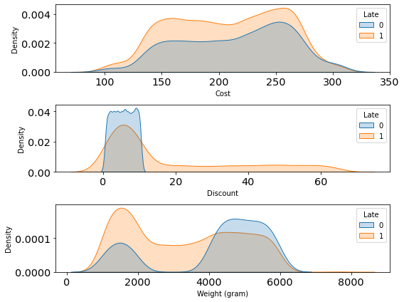
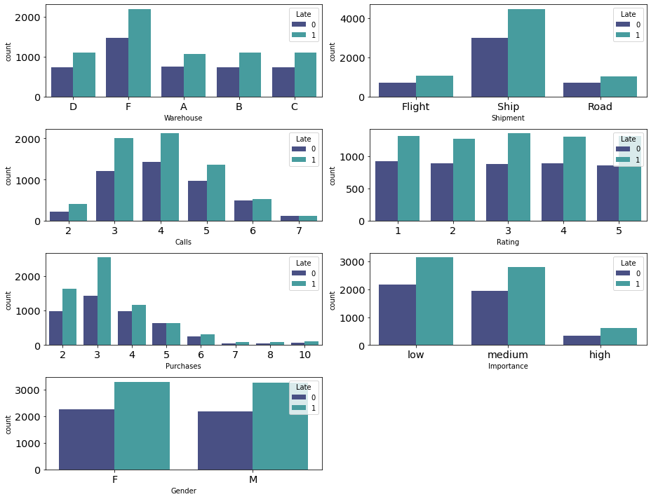
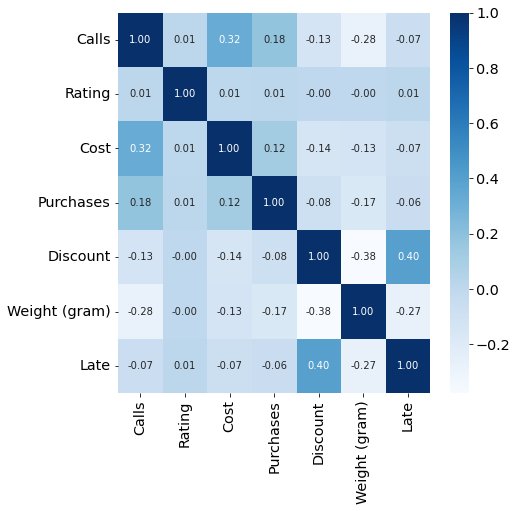

# <b>FINAL PROJECT</b>

Data source : https://www.kaggle.com/prachi13/customer-analytics

## <b>Kelompok 3 : Asklepios</b>

### <b>Anggota :</b>
<ul>
    <li>Awalsyah Rinanto Putra</li>
    <li>Fathah Oscar</li>
    <li>M Rizky Septiansyah P</li>
    <li>Hermawan Febrianto</li>
    <li>Devi Puji Ayuningsih</li>
    <li>Anggita Citanegara Lubis</li>
</ul>

## <b>Descriptive Statistics</b>
A. Semua tipe data dan nama kolom serta isinya sudah sesuai
B. Tidak ada kolom yang memiliki missing value
C. Jika dilihat dari nilai max, variable Purchase dan Discount kemungkinan memiliki nilai outlier

## <b>Univariate Analysis</b>

### <b>Hasil Observasi</b>
<ul>
    <li>Variable Purchases dan Discount memiliki outlier dan membentuk pola positively skewed</li>
    <li>Variable Cost memiliki distribusi yang paling mendekati distribusi normal</li>
    <li>Warehouse block yang paling banyak digunakan adalah Warehouse F</li>
    <li>Shipment mode yang dominan adalah pengiriman dengan kapal</li>
    <li>Jumlah sampel yang mengalami keterlambatan pengiriman lebih banyak</li>
</ul>

## <b>Multivariate Analysis</b>

### <b>Hasil Observasi</b>
A. Feature yang paling relevan dan harus dipertahankan adalah feature Discount dan Weight
B. Feature yang memiliki korelasi antar feature
<ul>
    <li>Weight terhadap Calls</li>
    <li>Weight terhadap Discount</li>
    <li>Cost terhadap Calls</li>
</ul>

## <b>Business Insight and Recommendation</b>
<ul>
    <li>Untuk pembelian produk dengan discount diatas 10% banyak mengalami keterlambatan pengiriman. Dalam hal ini pihak e-commerce perlu memberikan notifikasi keterlambatan pengiriman kepada customer ketika melakukan pembelian dengan menggunakan discount yang besar yang memungkinkan produk yang dipesan tidak terkirim tepat waktu.</li>
    <li>Barang dengan berat 2-4 Kg terkonfirmasi mengalami keterlambatan pengiriman. Dalam hal ini, pihak e-commerce perlu memberikan notifikasi keterlambatan pengiriman kepada customer yang membeli produk di rentang berat produk 2-4 kg sebelum customer melakukan transaksi.</li>
    <li>Semakin banyak customer care calls yang terjadi maka tingkat keterlambatan pengiriman semakin menurun. Berdasarkan data jumlah keterlambatan pengiriman menurun dengan meningkatnya jumlah telepon yang diterima oleh customer care. Perusahaan perlu mencari informasi mengenai isi telepon customer kepada customer care (siapa penelpon, isi telepon), sehingga bisa menentukan korelasi dengan jumlah keterlambatan pengiriman.</li>
</ul>
Rekomendasi dengan Asumsi:
<ol>
    <li>Bila di asumsikan bahwa pelanggan menelpon untuk melakukan konfirmasi pemesanan, maka bisa dilakukan proses konfirmasi pemesanan dari pelanggan memberikan pengingat kepada penjual untuk segera melakukan konfirmasi ketersediaan barang dan kesiapaan pengiriman kepada bagian pengiriman atau kurir. (bisa dengan aplikasi atau ditambahkan pada petugas tertentu).</li>
    <li>Bila di asumsikan bahwa penjual menelpon untuk melakukan konfirmasi kesediaan pesanan dan barang siap di kirim, maka bisa dilakukan proses otomatisasi saat penjual konfirmasi kesediaan barang, langsung barang disiapkan untuk di kirim pada hari yang sama dan mengirimkan konfirmasi untuk kurir mengirimkan.</li>
</ol>

## Data Pre-Processing
### Data Cleansing
- Dilakukan handle outliers pada feature Discount yang menghasilkan 8604 baris data
- Dilakukan standardization/normalization pada tiga feature yaitu: Cost, Discount dan Weight dikarenakan memiliki nilai variance dan standard deviation yang tinggi
- Merubah nilai kategorik menjadi numerik pada feature Gender dan Importance menggunakan Label Encoding, dan menggunakan One Hots Encoding pada feature Warehouse dan Shipment
- Proportion of minority >40% sehingga tidak perlu dilakukan handle class imbalance

### Feature Engineering
- Menghapus feature ID, Warehouse dan Shipment
- Feature yang bisa ditambahkan : waktu pengiriman, alamat customer, alamat warehouse, musim/cuaca, kapasitas pengiriman per-hari, dan traffic route
